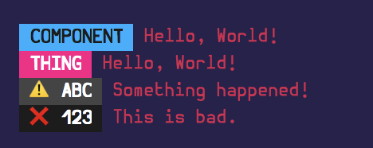

# Hagen

[](https://prettier.io/)
[](https://gitmoji.carloscuesta.me/)



A colorful logger for JS in Node and in the Browser (ES6 only). Named after Hagen, the colorful Lumberjack from [Synthie Forest](https://vimeo.com/90995716).

## Getting Started

### Installation

`yarn add hagen`

### Usage

Hagen extends `console.log`, `console.warn`, and `console.error`. It takes two string parameters: a `label` and a `message`.

The label's color is chosen randomly from a list of curated colors, by analyzing the string. The color will remain the same every time you use the same label.

You can additionally pass in an integer as a third parameter to manually select the color.

#### Node

```js
const hagen = require("hagen");

hagen.log("TEST", "Hello, World!");
hagen.warn("ABC", "Something happened!");
hagen.error("123", "This is bad.");

hagen.log("TEST", "Hello, World!", 3);
hagen.log("TEST", "Hello, World!", 5);
```

#### Browser (ES6+)

```js
import hagen from "hagen";

hagen.log("TEST", "Hello, World!");
hagen.warn("ABC", "Something happened!");
hagen.error("123", "This is bad.");

hagen.log("TEST", "Hello, World!", 3);
hagen.log("TEST", "Hello, World!", 5);
```

## Major Technologies

-   [Chalk](https://github.com/chalk/chalk)

## Inspirations

-   [xa](https://github.com/xxczaki/xa)

## Authors

-   [John Mars](http://m4r5.io)

## License

MIT © John Mars
